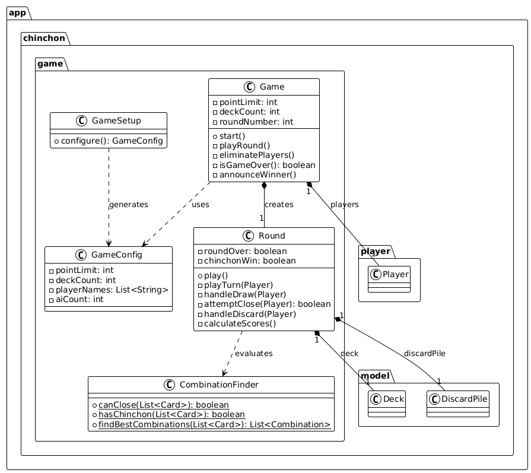

# Chinchón - Juego de Cartas

Este es un proyecto en Java que implementa una versión jugable por consola del clásico juego de cartas español **Chinchón**. 

## Descripción

El proyecto cuenta con un motor de juego que gestiona la lógica de las partidas, los turnos de los jugadores (incluyendo jugadores humanos y lógicas heurísticas/IA), y la manipulación de la baraja y manos de cartas. El programa se ejecuta a través de una interfaz de línea de comandos.

## Estructura del Proyecto

* **`src/`**: Código fuente de la aplicación (Java).
* **`test/`**: Pruebas unitarias (JUnit) para verificar la lógica del juego.
* **`lib/`**: Dependencias y librerías externas del proyecto.
* **`bin/`**: Archivos `.class` compilados.

## Diagrama de Clases (UML)

## Cómo ejecutar

El punto de entrada principal de la aplicación es la clase `Main`. 
Se puede iniciar la partida ejecutando `app.chinchon.Main` desde tu IDE (como Eclipse) o compilando los archivos fuente y ejecutando el `.class` resultante desde la terminal.
