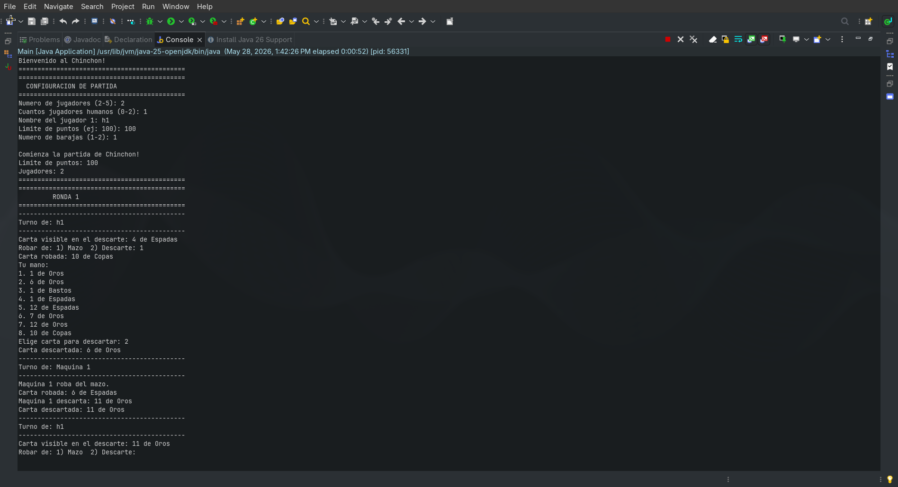
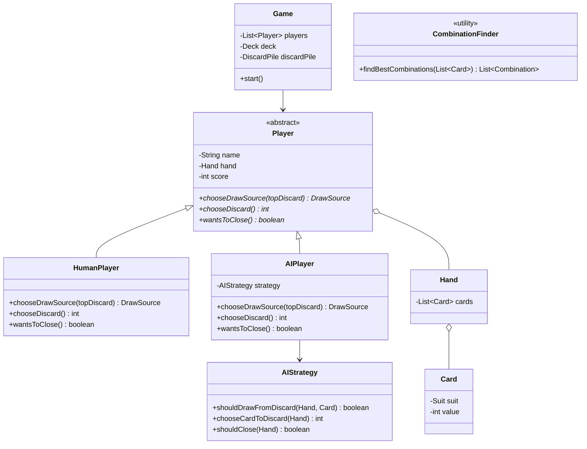
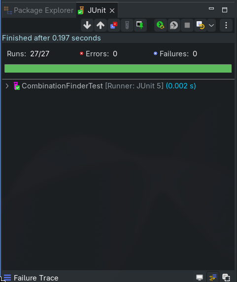

# Chinchón - Juego de Cartas (Proyecto de Programación)

Este proyecto implementa una versión jugable por consola del clásico juego de cartas español **Chinchón**. Desarrollado en Java, cuenta con un motor de juego que gestiona la lógica de las partidas, turnos, baraja y condiciones de victoria, integrando jugadores humanos y lógicas heurísticas (Inteligencia Artificial).

Este `README` ha sido redactado para cumplir con los estándares de documentación exigidos en el módulo de **Entornos de Desarrollo**, detallando la arquitectura, patrones, pruebas unitarias y estructura del proyecto.

---

## 1. Explicación del Juego

### Objetivo Principal
El objetivo del juego es formar combinaciones (series de cartas del mismo valor o escaleras del mismo palo) para quedarse con la menor cantidad de puntos posible en las cartas no combinadas, o conseguir un "Chinchón" (7 cartas consecutivas del mismo palo) para ganar la partida automáticamente.

### Funcionamiento y Jugabilidad
1. **Reparto**: Cada jugador recibe 7 cartas. El mazo sobrante se coloca boca abajo y se voltea una carta para iniciar la pila de descartes.
2. **Turnos**: En su turno, un jugador puede robar del mazo oculto o de la pila de descartes.
3. **Descarte**: Tras robar, el jugador debe descartarse de una carta para mantener siempre 7 cartas en la mano.
4. **Cierre**: Un jugador puede "cerrar" la ronda si tiene sus cartas combinadas y, como máximo, una carta suelta cuyo valor no exceda los 5 puntos.
5. **Recuento**: Tras cerrar, se cuentan los puntos de las cartas sin combinar de todos los jugadores. 

### Capturas de Pantalla

> 

---

## 2. Análisis del Proyecto

### Estructura de Carpetas

La arquitectura del repositorio sigue las convenciones estándar de proyectos Java:
* **`src/`**: Contiene todo el código fuente principal de la aplicación, dividido lógicamente en paquetes (`model`, `player`, `game`, `ai`, `util`).
* **`test/`**: Contiene las pruebas unitarias usando JUnit. Se mantiene separado de `src` para no mezclar el código de producción con el código de prueba.
* **`bin/`**: Carpeta destino donde el compilador o IDE (como Eclipse) genera los archivos compilados (`.class`).
* **`lib/`**: Dependencias externas necesarias para la ejecución (si las hubiera).
* **`docs/`**: Carpeta generada que contiene la documentación JavaDoc completa del proyecto.
* **`assets/`**: Recursos estáticos como capturas de pantalla o diagramas exportados.

### Diagrama de Clases (UML)

A continuación, se presenta un diagrama simplificado mostrando las relaciones más críticas del proyecto, modelado de forma dinámica:

### Descripción Breve de Clases Principales

*   `Game`: Orquesta el ciclo de vida de la partida, controlando las rondas y verificando ganadores.
*   `Round`: Representa una mano concreta del juego, gestionando el flujo de turnos hasta que alguien cierra.
*   `Player` (Abstracta): Define el contrato básico de un jugador (mano, puntos, estado).
*   `HumanPlayer` / `AIPlayer`: Implementaciones concretas de jugadores.
*   `AIStrategy`: Contiene la lógica matemática/heurística que permite a la IA tomar decisiones.
*   `CombinationFinder`: Clase utilitaria muy importante encargada de analizar recursivamente combinaciones óptimas en la mano de un jugador usando fuerza bruta optimizada.
*   `Card`, `Hand`, `Deck`, `DiscardPile`: Modelos del dominio representando los elementos físicos del juego.

### Patrones de Diseño Implementados

Se han implementado varios principios y patrones de diseño orientados a objetos para asegurar un código limpio, mantenible y escalable:

#### 1. Strategy Pattern (Patrón Estrategia)
*   **Justificación**: La lógica que define qué carta debe robar o descartar un bot (IA) puede cambiar o evolucionar independientemente del modelo físico del jugador. Extraer esta lógica facilita testear y crear en el futuro IAs de distinta dificultad.
*   **Código**: Clase `AIStrategy` inyectada como dependencia dentro de `AIPlayer`. `AIPlayer` delega las decisiones complejas invocando métodos de `strategy`.
*   **Explicación**: El `AIPlayer` no calcula sus jugadas; usa el objeto `AIStrategy` para decidir. Si mañana queremos una "IA Difícil", basta con crear una nueva clase de estrategia e inyectarla sin tocar la clase de jugador base.

#### 2. Template Method y Polimorfismo
*   **Justificación**: Tanto humanos como bots siguen las mismas reglas para jugar (robar, descartar, decidir cerrar), pero la forma de obtener esas respuestas varía (el humano usa teclado, el bot usa algoritmos).
*   **Código**: Clase abstracta `Player` con métodos abstractos (`chooseDrawSource`, `chooseDiscard`, `wantsToClose`). `HumanPlayer` y `AIPlayer` implementan y sobrescriben dichos comportamientos.
*   **Explicación**: La clase `Round` solo trata con una lista de objetos `Player`. No necesita saber si le está preguntando a un humano o a un bot. Gracias al polimorfismo, el código base de control de turnos es ciego a la naturaleza del jugador.

#### 3. Utility Class (Clase Utilitaria)
*   **Justificación**: `CombinationFinder` realiza cálculos matemáticos sobre conjuntos de cartas. No posee estado propio ni modifica el entorno, por lo que instanciarla sería un desperdicio de recursos.
*   **Código**: `CombinationFinder` es de tipo `final` con constructor `private` para impedir instancias y herencia. Expone únicamente métodos estáticos puros.

---

## 3. Pruebas Unitarias

La calidad del software se ha garantizado mediante el uso de **JUnit 5**, ubicando todo el entorno de pruebas en la carpeta `/test`, totalmente separado del código productivo que reside en `/src`.

### Enfoque Utilizado
Las pruebas están centradas en la clase más crítica y compleja de la aplicación: `CombinationFinder`. Dado que esta clase calcula las mejores combinaciones, un fallo aquí arruinaría la experiencia de juego.

Se ha diseñado el `CombinationFinderTest` combinando deliberadamente dos enfoques profesionales:
*   **Caja Blanca**: Pruebas diseñadas con conocimiento del código fuente interno, forzando la evaluación de ramificaciones `if/else`, condicionales dentro de flujos recursivos y casos base de excepciones. Ejemplos: `shouldNotFindGroupWhenOnlyTwoCardsHaveSameValue` (verifica que el bloque `if` corta combinaciones pequeñas).
*   **Caja Negra**: Pruebas donde se ignora el código interno y se verifican estrictamente los requisitos de negocio, enviando una entrada de datos válidos (una mano desordenada de cartas) y verificando que la salida sea exactamente la combinación esperada según las reglas del Chinchón clásico.

### Evidencias de Ejecución

> 

---

## 4. JavaDoc (Documentación Oficial)

Siguiendo las mejores prácticas de la industria, la totalidad del código incluye comentarios estandarizados listos para ser procesados. Se ha exportado la documentación HTML estática del proyecto.

Para visualizar las responsabilidades de todas las clases y firmas de métodos de forma estructurada:
1. Diríjase a la carpeta `docs/` en la raíz del repositorio.
2. Abra el archivo `index.html` en cualquier navegador web.
